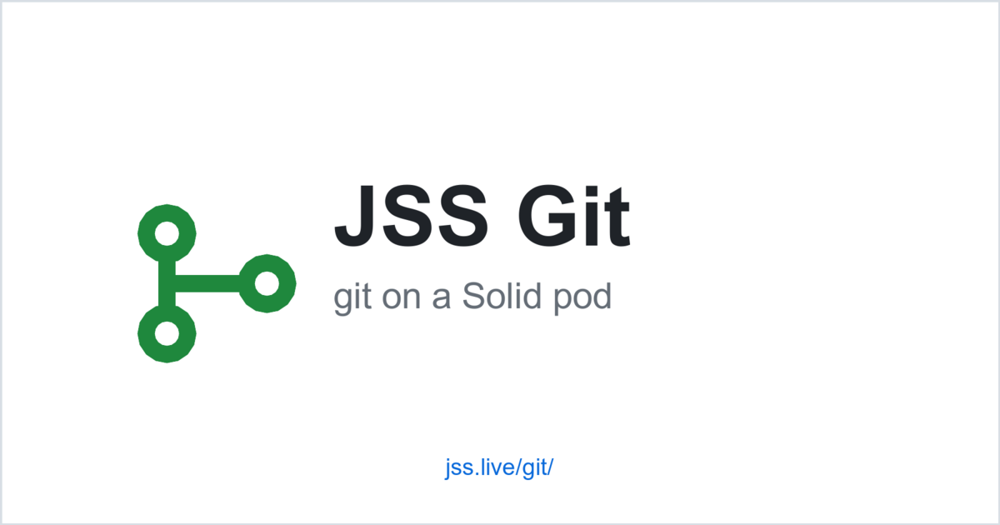

# JSS Git


**Web-based git browser for Solid pods.** A GitHub-style frontend that runs entirely in the browser against any git remote — including [JSS](https://jss.live)-hosted repositories on Solid pods.

🔗 **Live:** [jss.live/git/](https://jss.live/git/)
📖 **Companion guide:** [Git on Solid](https://jss.live/docs/guides/git-on-solid)



## Try it

Browse any JSS-hosted git repository:

```
https://jss.live/git/?repo=https://your.pod/path/to/repo
```

Demo repo:

```
https://jss.live/git/?repo=https://melvin.me/public/git/test/
```

## Features

- **File tree** with folder navigation and file-type icons
- **File content view** with syntax highlighting (JS, TS, HTML, CSS, JSON, Markdown, Python, Rust, Go, Java, YAML, Bash, ...)
- **Markdown rendering** for `README.md` and other `.md` files (with shields.io badge support)
- **Commits view** — full history with author, message, date, SHA
- **Commit detail view** — full message, parent commits, changed files (added / modified / deleted badges)
- **Branch dropdown** for multi-branch repos
- **Tags display** in sidebar
- **Clone box** with copy button
- **Repo header** with breadcrumb, visibility badge, Watch / Fork / Star action buttons (Solid-native impl planned)
- **About sidebar** with branch / refs / commits / files counts
- **OGP / Twitter Card** support — sharing a repo URL renders a clean preview

## Architecture

> *"Let Solid be Solid, and let Git be Git."* — [Git on Solid](https://jss.live/docs/guides/git-on-solid)

JSS Git is the browser-side companion to JSS's protocol-gateway git architecture (Pattern B in the guide above). It speaks the **real git smart-HTTP protocol (v2)** — not raw HTTP-fetching of `.git/objects/` paths.

| Component | What it does |
|---|---|
| **JSS server** | Exposes git smart-HTTP at any pod URL via `--git` flag (forwards to `git-http-backend`) |
| **JSS Git frontend** | Browser SPA that fetches refs and clones repos via standard git smart-HTTP, then renders a GitHub-style UI |

Why this matters:

- **Works on any compliant git remote** — JSS pods, GitHub, Gitea, custom servers
- **Handles packed refs and pack files** — the real git wire format, not just loose objects
- **No server changes needed** beyond JSS's standard `--git` flag
- **Future-proof for auth / push / branches** — uses the canonical git protocol

## Stack

- **[Preact](https://preactjs.com)** + **[HTM](https://github.com/developit/htm)** — lightweight UI without JSX
- **[isomorphic-git](https://isomorphic-git.org)** — pure-JS git implementation (handles smart-HTTP v2, pack files, delta compression)
- **[@isomorphic-git/lightning-fs](https://github.com/isomorphic-git/lightning-fs)** — IndexedDB-backed in-memory filesystem
- **[marked](https://marked.js.org)** — Markdown rendering
- **[Prism](https://prismjs.com)** — syntax highlighting

Bundled with [esbuild](https://esbuild.github.io/) into a single `app.js` (~1MB minified, includes browser polyfills for Node `crypto` / `stream`).

## Develop

```bash
git clone https://github.com/JavaScriptSolidServer/git.git
cd git
npm install
npm run build           # build app.js
python3 -m http.server  # serve locally
```

Edit `src/app.js`, then `npm run build` to regenerate the bundle.

## CORS requirements

Browser-side git clients must be able to send the `Git-Protocol` header for smart-HTTP v2. JSS allows this in CORS preflight responses since [#372](https://github.com/JavaScriptSolidServer/JavaScriptSolidServer/pull/372). Other servers may need configuration.

## Roadmap

- [ ] Per-file last commit info in the file tree
- [ ] File diff viewer in commit detail
- [ ] Solid-native stars / watch / fork (LDP container of WebID resources)
- [ ] RDF metadata reading (description, tags from pod's `.well-known/`)
- [ ] Markdown table-of-contents and anchor links
- [ ] Search

## License

[AGPL-3.0](LICENSE)
